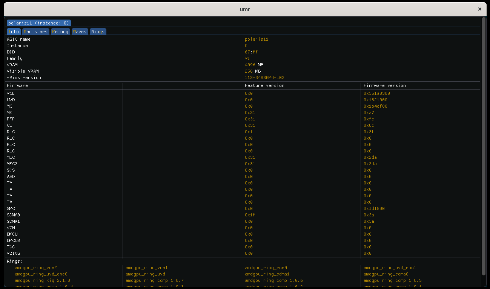
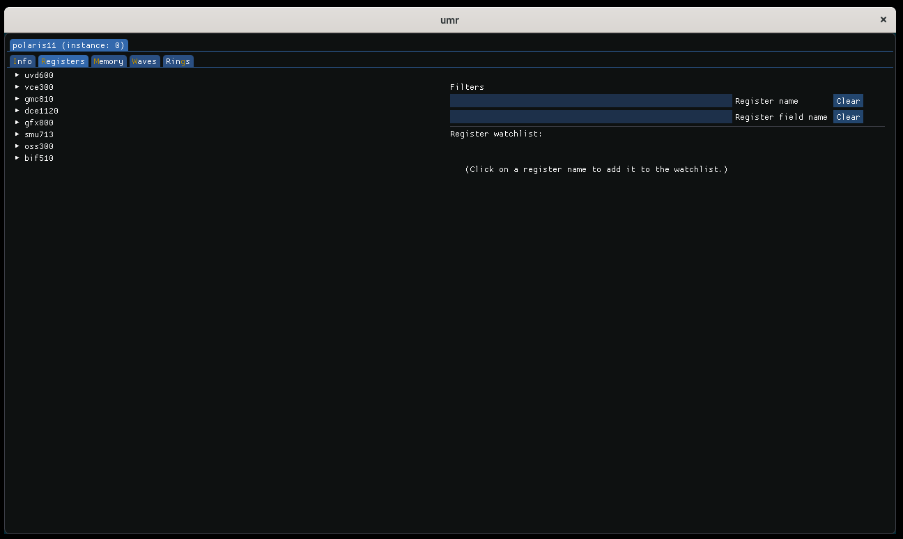
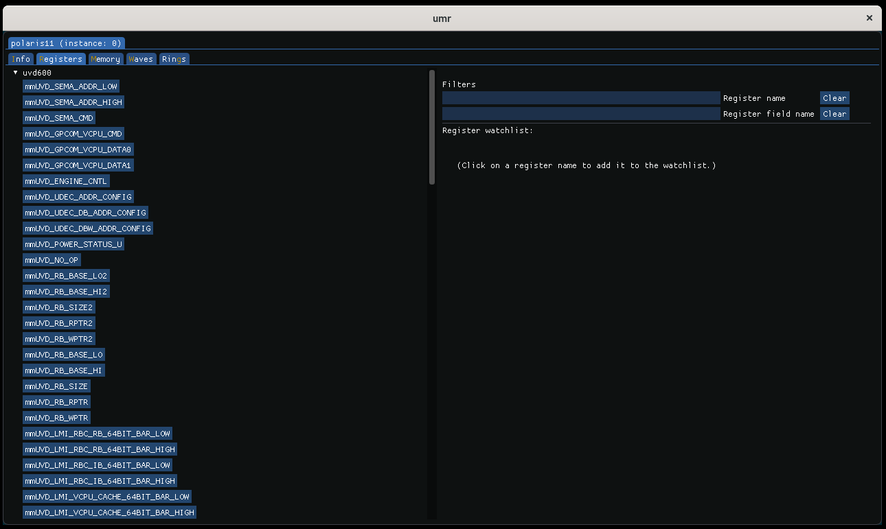
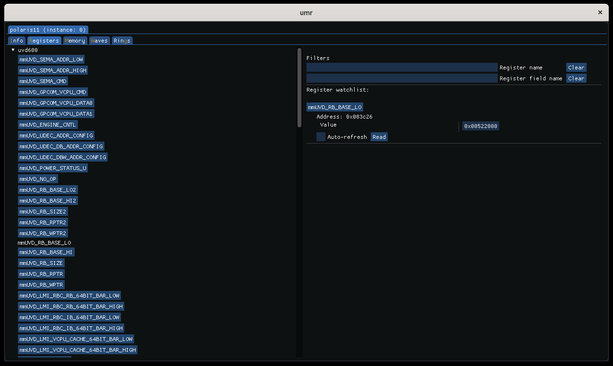
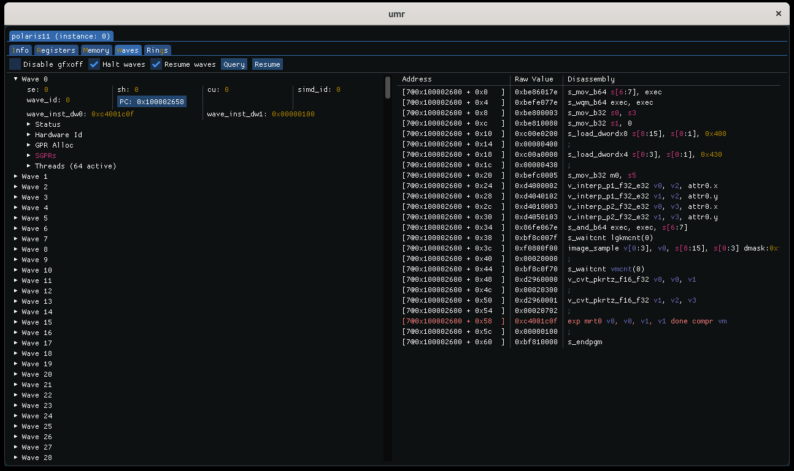
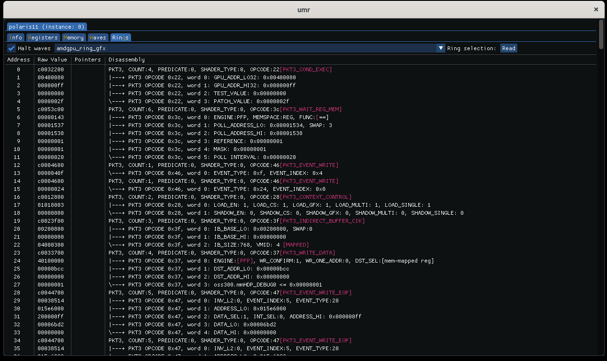

========================
Graphical User Interface
========================

When built with the GUI enabled the gui can be initialized with the *--gui* command:

::

	$ umr --gui

The landing page describes by default the 0th ASIC found with a variety of parameters and features.

The topmost tab is where all of the detected ASICs are displayed.  Below the ASIC tabs are the workpage tabs.
The default tab that opens is the info tab which display information about the ASIC such as firmware version, ring names,
memory configuration etc.

---------------
Register Access
---------------

The register page allows the user to read MMIO registers.

Registers can be selected by choosing one or more IP blocks.

Which can then be selected by clicking on the register on the left or searching for them by filling out one of the filters.

Here we have read uvd600.mmUVD_RB_BASE_LO and it is the value 0x00522000.  To stop inspecting a register the register can be clicked
on in the right half of the tab to restore it's original state in the gui.

-----------
Wave Status
-----------

Reading wave status is accomplished on the *Waves* tab.

In this example we have already halted and scanned for waves.  On the left half are a list of waves that were halted and valid at the time
of the scan.  By opening a wave the WAVE_STATUS fields are presented.  If the PC value is in a blue bounding box it means a shader
was captured which can be presented by clicking on the blue box.  In this example a shader was found and we it presented on the right.
The hightlighted line is where the PC register is pointing to.

-------------
Reading Rings
-------------

Reading rings is accomplished on the *Rings* tab.

The dropdown box allows the user to select any detected ring for the given ASIC.  Hitting the 'read' button
then reads and presents the contents of the ring with decoding where possible.
