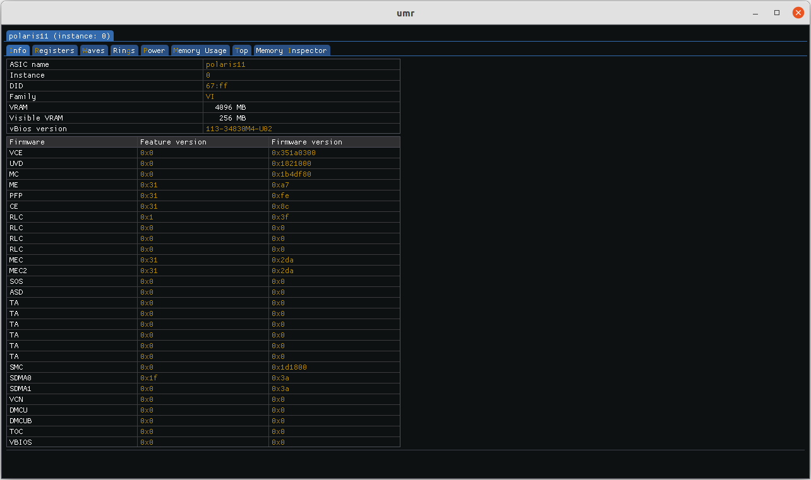
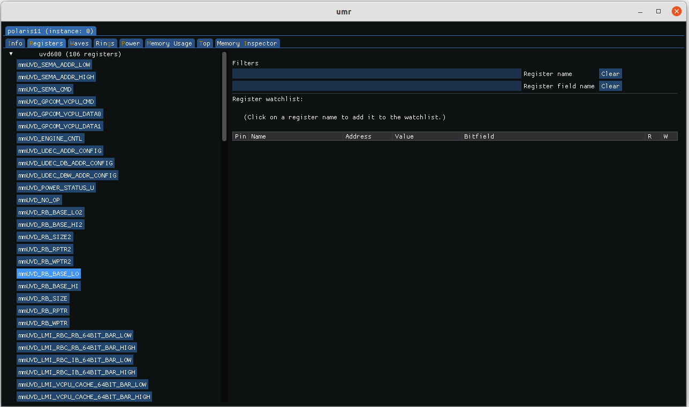
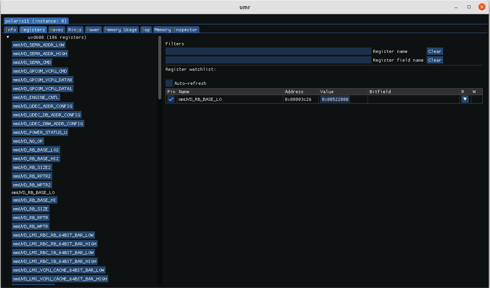
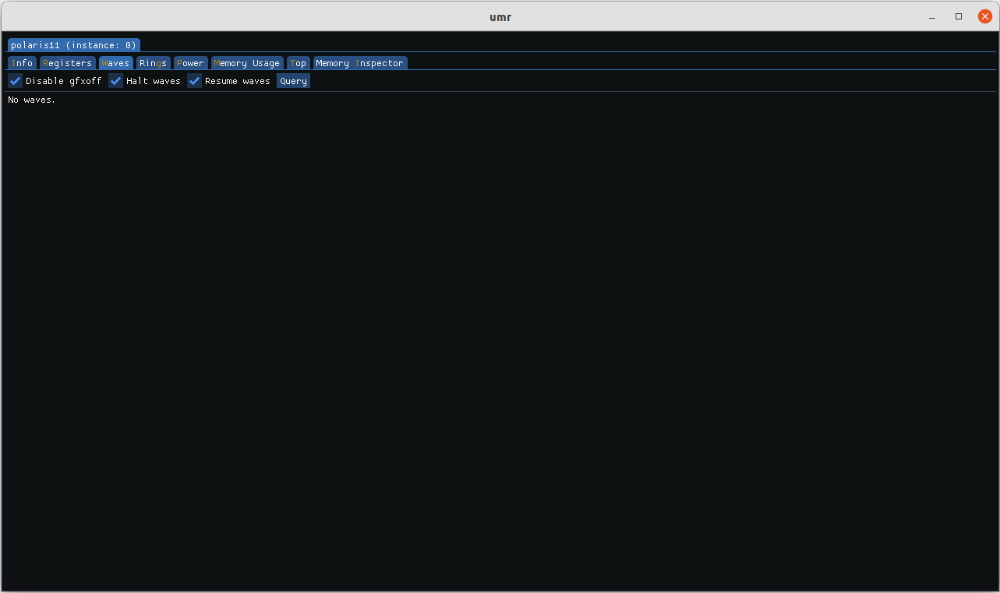
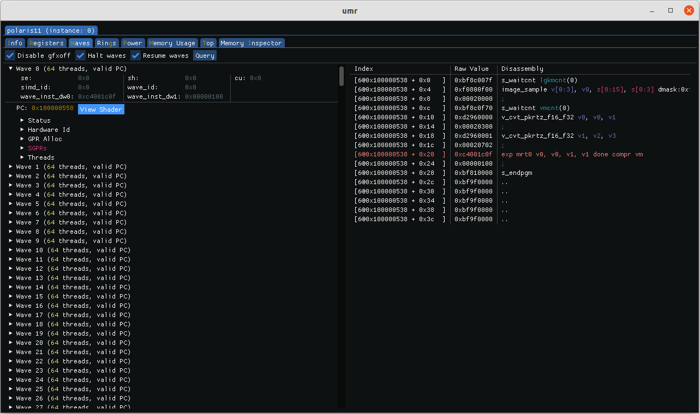
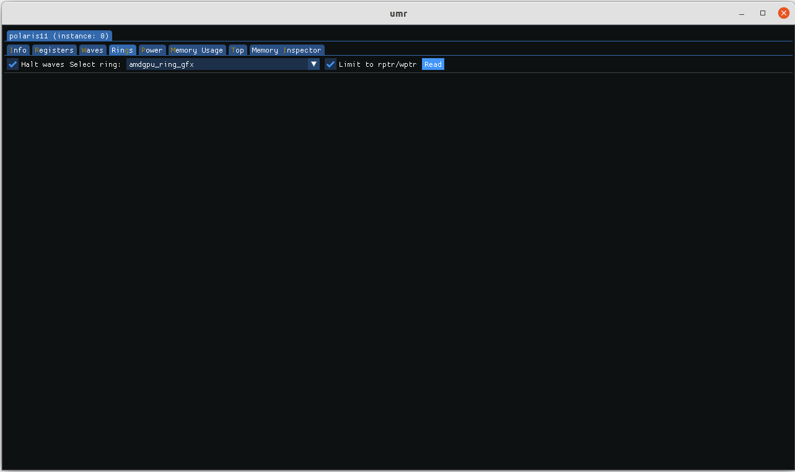
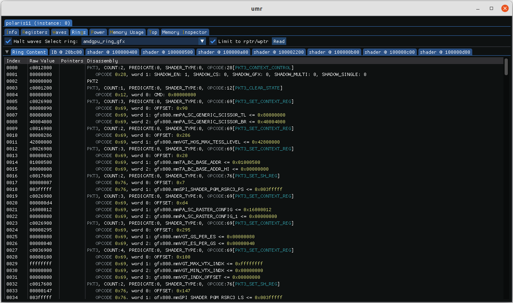
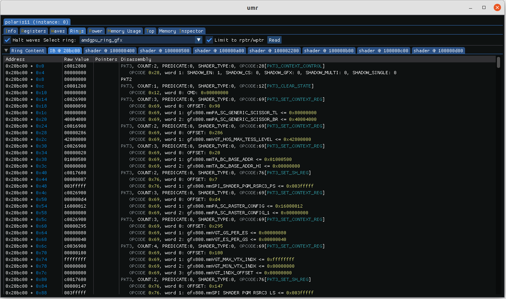
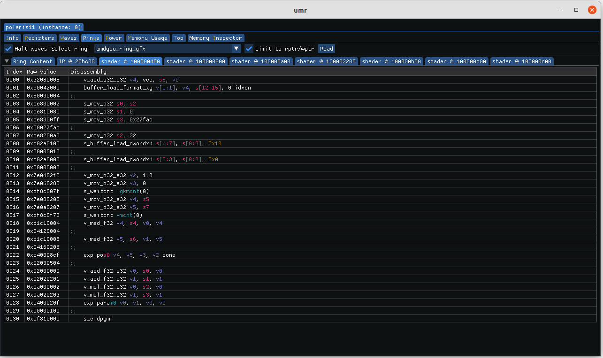

========================
Graphical User Interface
========================

UMR now comes with a GUI component that can be initialized with the *--gui* command:

::

	$ umr --gui

The landing page describes by default the 0th ASIC found with a variety of parameters and features.

The topmost tab is where all of the detected ASICs are displayed.  Below the ASIC tabs are the workpage tabs.
The default tab that opens is the info tab which display information about the ASIC such as firmware version, ring names,
memory configuration etc.

---------------
Register Access
---------------

The register page allows access to registers per IP block.

Registers can be read by clicking on them:

-----------
Wave Status
-----------

Reading wave status is accomplished on the *Waves* tab.

By clicking the query button active waves can be displayed.  Checking
'disable gfxoff' will ensure that the power saving feature GFXOFF does not
interrupt reading registers.

Once waves are queried they are listed by order of whcih waves are active.  The various
status registers can be displayed by expanding their fields, if a shader is
found it can be display in the right half by clicking 'view shader'.

-------------
Reading Rings
-------------

Reading rings is accomplished on the *Rings* tab.

The 'Limit to rptr/wptr' option is checked by default since normally reading
outside that range leads to undefined behaviour.  You can read outside it
by unchecking the box.

The initial reading tab shows the contents of the ring buffer itself.  By default
between the RPTR and WPTR.  The raw values as well as the decoding of the ring
are presented.  Tabs are added to the right if indirect buffers (IBs) or
shader programs are found.

Indirect buffer objects can be decoded as well.  The offset from the
start of the object is presented along with the raw values in order
to aid in debugging.

Shaders if found are presented in their own tabs named after the
GPUVM address they were found at.

